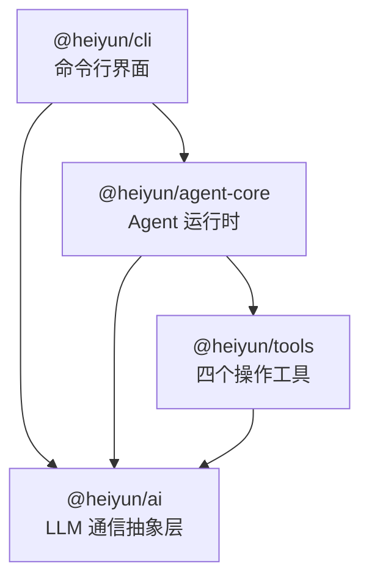

# 00 — 项目整体概览

> **阅读时间**：约 15 分钟  
> **前置知识**：基本的 JavaScript 语法（变量、函数、模块导入导出）

---

## 1. 一句话定位

**Heiyun Code** 是一个**终端里的 AI 编程助手**。你在命令行输入自然语言（比如"帮我写一个 HTTP 服务器"），它会调用大语言模型（LLM）理解你的意图，然后自动完成**读文件、改代码、执行命令**等一系列操作，最后把结果展示在终端里。

说人话：它就像把 ChatGPT 塞进了你的终端，而且 ChatGPT 不只是"聊天"，还能真的动手操作你的项目文件。

---

## 2. 它解决了什么问题？

想象你平常写代码时的工作流：

```
1. 打开文件看代码   →  手动操作
2. 修改几行代码     →  手动敲键盘
3. 运行命令测试     →  手动敲命令
4. 看报错，再改     →  再来一轮
```

Heiyun Code 把这个循环自动化了：你说一句话，它替你把上面 4 步全部做完，你只需要在旁边看着。

核心价值：
- **减少手工操作**：不用在编辑器、终端、浏览器之间来回切换
- **保持上下文**：AI 能看到你的整个项目，不丢失背景信息
- **全程可控**：每一步工具调用都展示给你看，可以随时中断

---

## 3. 项目目录结构

从项目根目录看下去：

```
heiyun-code/                        # 项目根目录
├── package.json                    # npm monorepo 配置，定义 4 个子包
├── tsconfig.base.json              # 所有子包共享的 TypeScript 编译配置
├── AGENTS.md                       # 项目开发规范（给 AI 看的"说明书"）
├── README.md                       # 用户文档
│
├── packages/                       # 所有子包都在这里
│   ├── ai/                         # 🔌 LLM 通信层
│   │   └── src/
│   │       ├── types.ts            #    核心类型定义（Message, ToolCall 等）
│   │       ├── openai.ts           #    OpenAI 兼容协议实现（SSE 流式请求）
│   │       └── index.ts            #    对外的"出口"（re-export）
│   │
│   ├── tools/                      # 🔧 四个文件/命令操作工具
│   │   └── src/
│   │       ├── read.ts             #    读取文件
│   │       ├── write.ts            #    写入文件
│   │       ├── edit.ts             #    精确替换文件内容
│   │       ├── bash.ts             #    执行 shell 命令
│   │       └── index.ts            #    汇总导出 + 路径安全上下文定义
│   │
│   ├── agent-core/                 # 🧠 Agent 运行时（核心大脑）
│   │   └── src/
│   │       ├── loop.ts             #    Agent 主循环（与 LLM 多轮对话的核心逻辑）
│   │       ├── session.ts          #    会话管理（JSONL 持久化存储）
│   │       ├── tool-registry.ts    #    工具注册中心（管理 4 个工具）
│   │       ├── system-prompt.ts    #    发送给 LLM 的系统提示词
│   │       ├── context-manager.ts  #    上下文压缩管理（防止超出 token 限制）
│   │       ├── token-counter.ts    #    Token 计数（估算 token 消耗）
│   │       ├── logger.ts           #    日志记录（排查 AI 调用错误）
│   │       ├── types.ts            #    agent-core 自己的类型定义
│   │       └── index.ts            #    对外导出
│   │
│   └── cli/                        # 🖥️ 命令行界面（用户直接交互的部分）
│       ├── bin/
│       │   └── heiyun.js           #    终端入口 shim（`heiyun` 命令的起点）
│       ├── src/
│       │   ├── main.ts             #    CLI 主逻辑（参数解析 + TUI 挂载）
│       │   ├── app.tsx             #    TUI 根组件（ink/React 写的终端 UI）
│       │   ├── config.ts           #    配置加载（合并设置/CLI参数/环境变量）
│       │   ├── settings.ts         #    用户设置持久化（~/.heiyun/settings.json）
│       │   ├── index.ts            #    对外导出
│       │   └── components/         #    TUI 组件
│       │       ├── chat-view.tsx   #      对话展示区
│       │       ├── input-box.tsx   #      输入框（含斜杠命令提示）
│       │       ├── status-bar.tsx  #      顶部状态栏
│       │       └── logo.tsx        #      ASCII Logo
│       │   └── slash-commands/     #    斜杠命令面板
│       │       ├── login.tsx       #      /login — API 登录配置
│       │       ├── model.tsx       #      /model — 模型选择
│       │       ├── resume.tsx      #      /resume — 恢复历史会话
│       │       └── compact.tsx     #      /compact — 手动压缩上下文
│       └── package.json            #    CLI 包的配置（发布用）
│
├── docs/                           # 项目文档（设计文档、计划文档）
│   └── superpowers/
│       ├── specs/                  #   设计规格文档
│       └── plans/                  #   实施计划文档
│
├── guide/                          # 📚 学习指导文档（你正在读的系列）
│
└── test/                           # 测试用临时文件（与项目功能无关）
```

---

## 4. 四大核心包的依赖关系

这是一个**严格线性依赖**的架构。依赖只能从上往下，不能反过来：



用文字描述：

| 包名 | 职责一句话 | 依赖谁 |
|------|-----------|--------|
| `@heiyun/ai` | 定义"消息"和"工具"是什么样子，实现与 LLM API 的通信 | 无依赖（纯基础层） |
| `@heiyun/tools` | 实现四个具体操作：读文件、写文件、编辑文件、执行命令 | `@heiyun/ai`（用它的类型定义） |
| `@heiyun/agent-core` | 实现"Agent 循环"：收到用户输入 → 调用 LLM → 执行工具 → 返回结果 → 再问 LLM | `@heiyun/ai` + `@heiyun/tools` |
| `@heiyun/cli` | 终端界面：解析命令行参数、渲染 TUI、响应用户输入 | `@heiyun/agent-core` + `@heiyun/ai` + `@heiyun/tools` |

为什么设计成这样？

- **每一层只做一件事**。比如 `@heiyun/ai` 只负责和 LLM 对话，完全不知道"文件"是什么。
- **方便替换**。如果想换一个 LLM 服务商（从 DeepSeek 换成 OpenAI），只需要改 `@heiyun/ai`，其他三个包不受影响。
- **方便测试**。每个包可以独立写测试代码，不需要启动整个项目。

---

## 5. 启动流程

当你在终端输入 `heiyun` 命令时，发生了什么？

```
终端输入 heiyun
  │
  ▼
packages/cli/bin/heiyun.js         ← 入口 shim（第 1 行）
  │  #!/usr/bin/env node
  │  import("../dist/main.js");    ← 动态导入打包后的主文件
  │
  ▼
packages/cli/src/main.ts           ← CLI 主逻辑
  │  1. Commander 解析命令行参数（--model, --session, --workdir...）
  │  2. loadConfig() 合并配置（settings.json > CLI参数 > 环境变量 > 默认值）
  │  3. 创建 OpenAIProvider（配置 API 地址、密钥、模型）
  │  4. 创建 Session（新建或加载历史会话）
  │  5. 创建 ToolRegistry（注册 4 个工具）
  │  6. 创建 ContextManager + TokenCounter（上下文管理）
  │  7. 用 ink 渲染 React TUI 到终端
  │
  ▼
packages/cli/src/app.tsx           ← TUI 根组件
  │  ┌──────────────────────────────┐
  │  │  StatusBar  (会话ID/模型/路径) │
  │  ├──────────────────────────────┤
  │  │  ChatView   (对话历史展示)     │
  │  │  InputBox   (用户输入框)       │
  │  └──────────────────────────────┘
  │
  ▼
用户输入一句话 → agentLoop() 启动 → 与 LLM 多轮对话 → 展示结果
```

关键文件标注：

| 步骤 | 文件 | 关键代码位置 |
|------|------|------------|
| 终端入口 | `packages/cli/bin/heiyun.js` | 第 1-2 行，整个文件只有两行 |
| 参数解析 | `packages/cli/src/main.ts` | 第 5-26 行，`new Command()` 配置 |
| 配置合并 | `packages/cli/src/config.ts` | 第 34-63 行，`loadConfig()` 函数 |
| 会话加载 | `packages/cli/src/main.ts` | 第 48-70 行，`if (config.sessionId)` 分支 |
| TUI 挂载 | `packages/cli/src/main.ts` | 第 202 行，`render(React.createElement(TuiWrapper))` |
| React 组件 | `packages/cli/src/app.tsx` | 第 50-130 行，`App` 组件 |

---

## 6. 技术栈速览

你会在项目中遇到这些技术，后续文档会逐一讲解：

| 技术 | 用在哪里 | 你暂时只需要知道 |
|------|---------|----------------|
| **TypeScript** | 整个项目 | JavaScript + 类型标注。代码更安全、更好读 |
| **ink** | CLI 包 | 用 React 组件写终端界面（而不是 HTML） |
| **Commander** | CLI 包 | 解析命令行参数（`--model`、`--session` 等） |
| **tsup** | 构建 | 把 TypeScript 源码打包成可执行的 JS |
| **npm workspaces** | 根目录 | 在一个仓库里管理多个 npm 包 |

---

## 7. 阅读顺序建议

接下来按这个顺序阅读本系列文档：

```
00 项目整体概览.md     ← 你在这里
01 TypeScript 基础知识速览.md
02 项目核心模块详解.md
03 辅助模块详解.md
04 数据流与状态管理.md
05 常见疑问与学习路线.md
```

> **下一步**：打开 `guide/01-TypeScript基础知识速览.md`，我们先快速掌握看懂这个项目需要的 TypeScript 知识。
