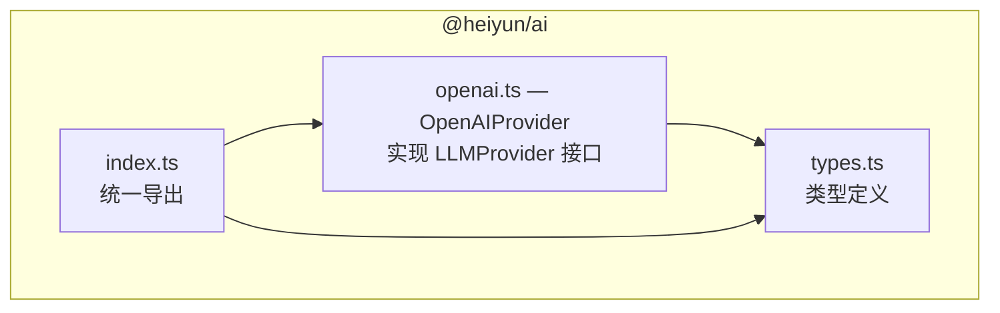
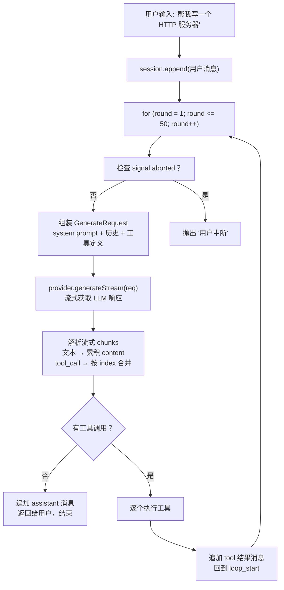
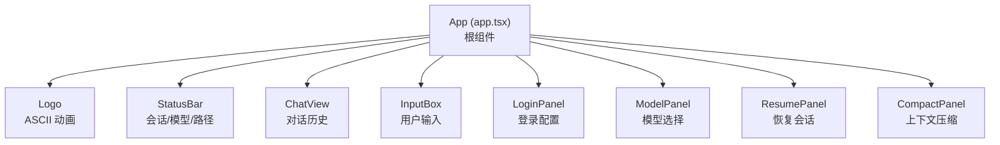
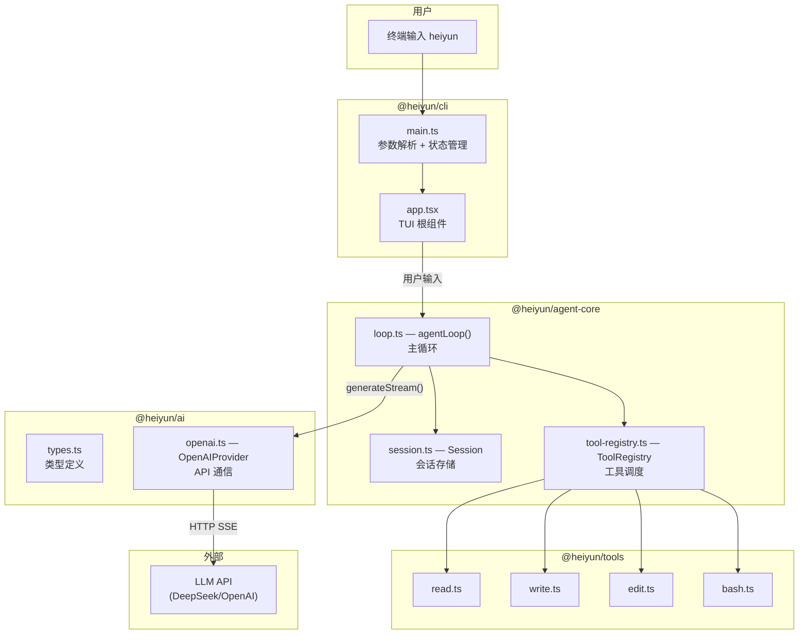

# 02 — 项目核心模块详解

> **阅读时间**：约 45 分钟  
> **前置知识**：文档 00（项目概览）+ 文档 01（TS 速览）  
> **阅读方式**：建议打开源码，每读完一个小节就看一眼对应的文件

---

本文逐包分析四大核心模块。写作顺序按依赖关系从底向上：先看最基础的类型层，再看工具层，然后看大脑层，最后看界面层。

---

## 模块一：`@heiyun/ai` — LLM 通信抽象层

### 功能描述

这是整个项目最底层的包。它的职责就两个：
1. **定义类型**：把"消息"、"工具"、"工具调用结果"这些概念用 TS 接口描述清楚
2. **实现通信**：通过 HTTP SSE 协议与大语言模型 API 对话

### 涉及文件

| 文件 | 作用 |
|------|------|
| `packages/ai/src/types.ts` | 所有核心类型定义（Message、ToolCall、ToolResult 等） |
| `packages/ai/src/openai.ts` | OpenAI 兼容协议的实现（发送请求、解析 SSE 流、重试） |
| `packages/ai/src/index.ts` | 对外统一导出（re-export） |

### 2.1.1 类型体系（`types.ts`）

这个文件是整个项目的**类型基石**，所有其他包都引用这里的定义。按功能分为四个板块：

#### 板块一：消息相关类型（第 1-26 行）

```typescript
// types.ts 第 3-8 行
export interface TextContent {
  type: "text";
  text: string;
}

export interface ImageContent {
  type: "image_url";
  image_url: { url: string };
}

// types.ts 第 12 行
export type ContentPart = TextContent | ImageContent;

// types.ts 第 20-26 行
export interface Message {
  role: "system" | "user" | "assistant" | "tool";
  content: string | null;
  tool_call_id?: string;
  tool_calls?: ToolCall[];
  name?: string;
}
```

`Message` 是项目中使用频率最高的类型。它代表**一条对话记录**。四种角色（role）：

| role | 谁说的 | 举例 |
|------|--------|------|
| `system` | 系统指令 | "你是一个编程助手..." |
| `user` | 用户 | "帮我写个 HTTP 服务器" |
| `assistant` | AI 回复 | "好的，我来帮你..." |
| `tool` | 工具执行结果 | `{ "success": true, "output": "..." }` |

#### 板块二：工具相关类型（第 30-56 行）

```typescript
// types.ts 第 14-18 行 — 工具调用（AI 想调用哪个工具、传什么参数）
export interface ToolCall {
  id: string;
  type: "function";
  function: {
    name: string;       // 工具名，如 "read"、"bash"
    arguments: string;  // 参数 JSON 字符串，如 '{"path":"/src/a.ts"}'
  };
}

// types.ts 第 40-45 行 — 工具定义（告诉 AI 有什么工具可用）
export interface ToolDefinition {
  name: string;
  description: string;
  parameters: ToolParameter;
}

// types.ts 第 49-55 行 — 工具调用 Delta（流式传输中的"碎片"）
export interface ToolCallDelta {
  index: number;
  id?: string;
  type: "function";
  function?: { name?: string; arguments?: string; };
}
```

`ToolCallDelta` 是理解"流式工具调用"的关键。LLM 的工具调用参数不会一次性传完，而是分多个 `delta` 片段送达。后面会看到怎么合并它们。

#### 板块三：LLM 交互类型（第 60-80 行）

```typescript
// types.ts 第 62-70 行 — 发给 LLM 的请求
export interface GenerateRequest {
  model: string;
  messages: Message[];
  tools?: ToolDefinition[];
  tool_choice?: "auto" | "none" | "required";
  max_tokens?: number;
  temperature?: number;
  stream?: boolean;
  signal?: AbortSignal;
}

// types.ts 第 75-79 行 — LLM 流式响应的每个"片段"
export interface GenerateChunk {
  type: "text" | "tool_call" | "finish";
  text?: string;
  toolCall?: Partial<ToolCallDelta>;
}
```

#### 板块四：Provider 接口 + 结果类型（第 83-98 行）

```typescript
// types.ts 第 88-90 行 — 核心抽象接口
export interface LLMProvider {
  generateStream(req: GenerateRequest): AsyncGenerator<GenerateChunk>;
}

// types.ts 第 94-97 行 — 工具执行结果
export interface ToolResult {
  success: boolean;
  output: string;
  error?: string;
  metadata?: { ... };
}
```

`LLMProvider` 是理解整个架构的关键接口。整个项目就是围绕这一个方法运转的：**传入请求 → 流式产出响应**。

### 2.1.2 通信实现（`openai.ts`）

**文件**：`packages/ai/src/openai.ts`  
**核心类**：`OpenAIProvider`（第 3-152 行）

#### 构造函数：配置来源的优先级链（第 14-22 行）

```typescript
// openai.ts 第 14-22 行
constructor(opts?: { ... }) {
  this.apiBase = opts?.apiBase ?? process.env.HEIYUN_CODE_API_BASE ?? "https://api.deepseek.com/v1";
  this.apiKey = opts?.apiKey ?? process.env.HEIYUN_CODE_API_KEY ?? "";
  this.model = opts?.model ?? process.env.HEIYUN_CODE_MODEL ?? "deepseek-chat";
  this.maxTokens = opts?.maxTokens ?? 4096;
  this.temperature = opts?.temperature ?? 0.7;
}
```

优先级：**构造函数参数 > 环境变量 > 硬编码默认值**。

#### `generateStream()`：核心通信方法（第 50-152 行）

这是项目中最长的单个方法，但逻辑清晰：

```
1. 组装请求 URL 和 body（第 51-69 行）
2. 重试循环（最多 3 次，第 72-152 行）
   ├─ 发送 fetch 请求（第 75-83 行）
   ├─ 检查 HTTP 状态码（第 85-93 行）
   │   ├─ 4xx → 不重试，直接抛错
   │   └─ 5xx → 重试
   ├─ 读取 SSE 流（第 99-151 行）
   │   ├─ 按 \n\n 分割事件（第 108 行）
   │   ├─ 解析 data: 行（第 114-116 行）
   │   ├─ [DONE] → 结束（第 118-120 行）
   │   ├─ delta.content → yield 文本（第 127-128 行）
   │   └─ delta.tool_calls → yield 工具调用（第 130-144 行）
   └─ 失败处理：等待重试（第 147-149 行）
```

SSE（Server-Sent Events）格式长这样：
```
data: {"choices":[{"delta":{"content":"你"}}]}

data: {"choices":[{"delta":{"content":"好"}}]}

data: [DONE]
```

`OpenAIProvider` 就是把这些原始文本解析成 `GenerateChunk` 对象。

### 2.1.3 模块调用关系



---

## 模块二：`@heiyun/tools` — 四个操作工具

### 功能描述

提供 AI 代理可以调用的四个基础工具，都是对文件系统和 shell 的封装：
- `read` — 读文件
- `write` — 写/覆盖文件
- `edit` — 精确替换文件内容
- `bash` — 执行 shell 命令

每个工具都包含**两层安全校验**：路径穿越检测 + 敏感路径黑名单。

### 涉及文件

| 文件 | 作用 |
|------|------|
| `packages/tools/src/read.ts` | read 工具 — 读文件并返回带行号的内容 |
| `packages/tools/src/write.ts` | write 工具 — 创建或覆盖文件 |
| `packages/tools/src/edit.ts` | edit 工具 — 精确字符串替换 |
| `packages/tools/src/bash.ts` | bash 工具 — 执行 shell 命令 |
| `packages/tools/src/index.ts` | 汇总导出 + `allTools` 数组 |

### 2.2.1 统一的工具模式

四个工具遵循完全相同的代码模式：

```
1. 导出 definition（工具定义，告诉 LLM 这个工具叫什么、能做什么）
2. 导出 executeXxx()（执行函数，接收参数 → 返回 ToolResult）
3. 内部调用 resolveSafePath() 做安全检查
```

以 `read` 为例：

**文件**：`packages/tools/src/read.ts`

```
第 5-19 行  → readDefinition：定义工具名、参数、描述
第 27-42 行 → resolveSafePath()：路径安全校验
第 47-78 行 → executeRead()：核心执行逻辑
```

### 2.2.2 路径安全模型（`resolveSafePath()`）

**文件**：`packages/tools/src/read.ts`  
**行号**：第 27-42 行

```typescript
function resolveSafePath(inputPath: string, workdir: string): string {
  // 第一步：把相对路径解析成绝对路径
  const resolved = path.isAbsolute(inputPath)
    ? path.resolve(inputPath)
    : path.resolve(workdir, inputPath);

  // 第二步：检查路径是否在 workdir 内（防止 ../ 穿越）
  const normalizedWorkdir = path.resolve(workdir);
  if (!resolved.startsWith(normalizedWorkdir + path.sep) && resolved !== normalizedWorkdir) {
    throw new Error(`路径穿越被拒绝: ${inputPath}`);
  }

  // 第三步：检查是否命中敏感路径黑名单
  const normalized = path.normalize(resolved).toLowerCase();
  const blockedPrefixes = ["/etc", "/proc", "/sys", "/dev", "/system", "/windows"];
  for (const bp of blockedPrefixes) {
    if (normalized.startsWith(bp) || ...) {
      throw new Error(`敏感路径被拒绝: ${resolved}`);
    }
  }

  return resolved;
}
```

这三步防止了：
1. AI 读取项目外的文件（`../../etc/passwd`）
2. AI 操作系统关键目录（`/etc`、`/proc` 等）

### 2.2.3 四个工具速览

| 工具 | 文件 | 核心函数 | 行号 | 特殊行为 |
|------|------|---------|------|---------|
| read | `read.ts` | `executeRead()` | 47-78 | 自动分行+行号标注；最大 5000 行；拒绝目录 |
| write | `write.ts` | `executeWrite()` | 47-64 | 自动创建父目录；全量覆盖 |
| edit | `edit.ts` | `executeEdit()` | 47-84 | 要求唯一匹配；0 次或 N>1 次均报错 |
| bash | `bash.ts` | `executeBash()` | 37-101 | 120 秒超时；危险命令黑名单；跨平台 shell |

### 2.2.4 危险命令检测（bash 特有）

**文件**：`packages/tools/src/bash.ts`  
**行号**：第 27-29 行

```typescript
const DANGEROUS_PATTERNS = [
  /rm\s+-rf\s+\//i,    // rm -rf /
  /sudo\s/i,            // sudo
  /mkfs/i,              // mkfs（格式化）
  /dd\s+if=/i,          // dd if=（磁盘拷贝）
  /:\s*\(\s*\)\s*\{/,   // fork 炸弹
  />\s*\/dev\/sda/,     // 重定向到磁盘设备
  /chmod\s+777\s+\//,   // chmod 777 /
];
```

AI 执行的命令会先经过 `isDangerous()`（第 31-33 行）检查，命中任何一个正则都会被拒绝。

### 2.2.5 `allTools` 汇总（index.ts）

**文件**：`packages/tools/src/index.ts`  
**行号**：第 13-18 行

```typescript
export const allTools = [
  { definition: readDefinition, execute: executeRead },
  { definition: writeDefinition, execute: executeWrite },
  { definition: editDefinition, execute: executeEdit },
  { definition: bashDefinition, execute: executeBash },
] as const;
```

这个数组被 `ToolRegistry` 在构造时自动注册（见模块三）。

---

## 模块三：`@heiyun/agent-core` — Agent 运行时

### 功能描述

这是项目的**大脑**。它做的事：
1. 接收用户输入
2. 组装请求发给 LLM
3. 解析响应：如果是文本就展示，如果是工具调用就执行
4. 把工具结果送回 LLM，让它决定下一步
5. 循环往复，直到 LLM 不再调用工具、或达到最大轮次

### 涉及文件

| 文件 | 作用 |
|------|------|
| `packages/agent-core/src/types.ts` | SessionNode、SessionMeta、LoopOptions 类型 |
| `packages/agent-core/src/system-prompt.ts` | 发送给 LLM 的系统指令 |
| `packages/agent-core/src/session.ts` | 会话管理（JSONL 存储） |
| `packages/agent-core/src/tool-registry.ts` | 工具注册与调度 |
| `packages/agent-core/src/loop.ts` | **核心**：Agent 主循环 |
| `packages/agent-core/src/context-manager.ts` | 上下文压缩（见文档 03） |
| `packages/agent-core/src/token-counter.ts` | Token 计数（见文档 03） |
| `packages/agent-core/src/logger.ts` | 日志记录（见文档 03） |
| `packages/agent-core/src/index.ts` | 统一导出 |

### 2.3.1 System Prompt（系统提示词）

**文件**：`packages/agent-core/src/system-prompt.ts`  
**行号**：第 1-19 行（整个文件就是一个字符串常量）

这个 ~740 字符的字符串是发给 LLM 的第一条消息。它告诉 AI：
- 你是谁（Heiyun Code 交互式编码代理）
- 你有什么工具（read/write/edit/bash + 简要使用说明）
- 行为规则（先读后改、小改用 edit 大改用 write、回复用中文、技术术语保留英文）

这个 prompt 被用在 `loop.ts` 第 93 行：
```typescript
// loop.ts 第 93 行
messages: [
  { role: "system", content: SYSTEM_PROMPT },
  ...ctxMessages,
],
```

### 2.3.2 Session（会话管理）

**文件**：`packages/agent-core/src/session.ts`  
**核心类**：`Session`（第 6-93 行）

#### 数据结构

每条消息存为一个 `SessionNode`（定义在 `types.ts` 第 3-10 行）：

```typescript
export interface SessionNode {
  id: string;            // UUID，每条消息的唯一标识
  timestamp: string;     // ISO 时间戳
  role: "system" | "user" | "assistant" | "tool" | "summary";
  content: string | null;
  tool_calls?: ToolCall[];
  tool_call_id?: string;
  name?: string;
}
```

#### 存储格式：JSONL

**文件**：`packages/agent-core/src/session.ts`  
**行号**：第 21-26 行（`append()` 方法）

```typescript
append(node: Omit<SessionNode, "id" | "timestamp">): void {
  const full: SessionNode = {
    ...node,
    id: crypto.randomUUID(),
    timestamp: new Date().toISOString(),
  };
  this.messages.push(full);
  const line = JSON.stringify(full) + "\n";
  fs.appendFileSync(this.filePath, line, "utf-8");
}
```

JSONL（JSON Lines）格式：每行一个 JSON 对象。优势是：
- 追加写入极快（不需要读整个文件再写回去）
- 损坏一行不影响其他行
- 可以用 `tail -f` 实时查看

#### 主要方法

| 方法 | 行号 | 作用 |
|------|------|------|
| `constructor()` | 10-13 | 创建新会话或使用已有 ID |
| `append()` | 15-26 | 追加一条消息（自动加 id 和时间戳） |
| `getMessages()` | 28-30 | 获取内存中的全部消息 |
| `getMessageRange()` | 35-37 | 获取指定范围的消息（上下文压缩用） |
| `replaceRange()` | 42-66 | 原子替换一段消息（上下文压缩用） |
| `static load()` | 68-77 | 从 JSONL 文件恢复会话 |
| `static list()` | 79-93 | 列出所有历史会话 |

### 2.3.3 ToolRegistry（工具注册中心）

**文件**：`packages/agent-core/src/tool-registry.ts`  
**核心类**：`ToolRegistry`（第 8-68 行）

```typescript
export class ToolRegistry {
  private tools = new Map<string, ToolHandler>();  // 第 11 行

  constructor(logger?: Logger) {
    this.logger = logger;
    this.registerBuiltins();  // 自动注册 allTools
  }

  private registerBuiltins(): void {     // 第 25-28 行
    for (const tool of allTools) {
      this.register(tool);
    }
  }

  getDefinitions(): ToolDefinition[] {  // 第 34-36 行
    return Array.from(this.tools.values()).map((t) => t.definition);
  }

  async execute(toolCall: ToolCall, ctx: ToolContext): Promise<ToolResult> {
    // 第 38-68 行
    const handler = this.tools.get(toolCall.function.name);
    if (!handler) { return { success: false, error: "未知工具" }; }

    let params: Record<string, unknown>;
    try {
      params = JSON.parse(toolCall.function.arguments);
    } catch {
      return { success: false, error: "参数 JSON 解析失败" };
    }

    return await handler.execute(params, ctx);
  }
}
```

设计上它是一个 **Map 字典**：工具名 → 工具处理器。核心方法是 `execute()`，做的三件事：
1. 查字典 → 找到对应工具
2. 解析参数 → `JSON.parse()` 把 LLM 传来的参数字符串转成对象
3. 执行 → 调用工具的执行函数，返回 `ToolResult`

### 2.3.4 Agent Loop（核心循环）⭐

**文件**：`packages/agent-core/src/loop.ts`  
**核心函数**：`agentLoop()`（第 41-131 行）

这是整个项目最重要的函数。下面是它的完整执行流程：



对应的代码（简化版）：

```typescript
// loop.ts 第 41-131 行
export async function agentLoop(
  provider: LLMProvider,
  session: Session,
  toolRegistry: ToolRegistry,
  userInput: string,
  options: LoopOptions,
  workdir: string,
  callbacks?: LoopCallbacks,
  logger?: Logger,
  contextManager?: ContextManager
): Promise<string> {

  // 第一步：记录用户输入
  session.append({ role: "user", content: userInput });

  // 第二步：进入循环（最多 50 轮）
  for (let round = 1; round <= options.maxRounds; round++) {
    // 检查是否被中断
    if (options.signal?.aborted) throw new Error("用户中断");

    // 组装请求
    const req: GenerateRequest = {
      model: options.model,
      messages: [
        { role: "system", content: SYSTEM_PROMPT },
        ...ctxMessages,  // 历史对话
      ],
      tools: toolRegistry.getDefinitions(),
      // ...
    };

    // 流式获取 LLM 响应
    let assistantContent = "";
    const toolCalls: ToolCall[] = [];

    for await (const chunk of provider.generateStream(req)) {
      if (chunk.type === "text") {
        assistantContent += chunk.text!;
        callbacks?.onText?.(chunk.text!);  // 实时展示
      } else if (chunk.type === "tool_call") {
        mergeToolCallDelta(toolCalls, chunk.toolCall!);
      }
    }

    // 没有工具调用 → 结束
    if (toolCalls.length === 0) {
      session.append({ role: "assistant", content: assistantContent });
      return assistantContent;
    }

    // 有工具调用 → 执行
    session.append({ role: "assistant", content: assistantContent, tool_calls: toolCalls });

    for (const tc of toolCalls) {
      const result = await toolRegistry.execute(tc, { workdir, ... });
      session.append({ role: "tool", content: JSON.stringify(result), tool_call_id: tc.id });
    }
    // 回到循环顶部，让 LLM 看到工具结果后继续思考
  }

  throw new Error(`超过最大轮次 (${options.maxRounds})`);
}
```

#### `mergeToolCallDelta()`：碎片合并（第 21-38 行）

这是理解"LLM 怎么调用工具"的关键函数：

```typescript
// loop.ts 第 21-38 行
function mergeToolCallDelta(toolCalls: ToolCall[], delta: Partial<ToolCallDelta>): void {
  if (!delta.function) return;

  const { index } = delta;

  // 确保数组长度够（可能先收到 index=1 的片段）
  while (toolCalls.length <= index) {
    toolCalls.push({ id: "", type: "function", function: { name: "", arguments: "" } });
  }

  const target = toolCalls[index];
  if (delta.id) target.id = delta.id;
  if (delta.function.name) target.function.name = delta.function.name;
  if (delta.function.arguments) target.function.arguments += delta.function.arguments;
  //                                                          ↑↑ 关键：用 += 拼接
}
```

LLM 的流式工具调用是这样的：
```
第 1 个 chunk: { index: 0, function: { name: "re" } }
第 2 个 chunk: { index: 0, function: { arguments: "ad" } }
第 3 个 chunk: { index: 0, function: { arguments: "(\"a.ts\")" } }
```

合并后得到：`{ name: "read", arguments: "(\"a.ts\")" }` — 一个完整的工具调用。

---

## 模块四：`@heiyun/cli` — 命令行界面

### 功能描述

这是用户直接接触的部分。它负责：
1. 解析命令行参数
2. 加载配置
3. 用 React + ink 渲染终端 UI
4. 响应用户输入，调用 `agentLoop()`

### 涉及文件

| 文件 | 作用 |
|------|------|
| `packages/cli/bin/heiyun.js` | 终端入口 shim |
| `packages/cli/src/main.ts` | CLI 主逻辑（参数解析 + TUI 挂载 + 状态管理） |
| `packages/cli/src/config.ts` | 配置合并（settings > CLI > env > 默认） |
| `packages/cli/src/settings.ts` | 用户设置持久化（~/.heiyun/settings.json） |
| `packages/cli/src/app.tsx` | TUI 根组件（React 组件树） |
| `packages/cli/src/components/chat-view.tsx` | 对话展示区 |
| `packages/cli/src/components/input-box.tsx` | 输入框 + 斜杠命令提示 |
| `packages/cli/src/components/status-bar.tsx` | 状态栏 |
| `packages/cli/src/components/logo.tsx` | Logo |

### 2.4.1 启动入口

**文件**：`packages/cli/bin/heiyun.js`  
**行号**：第 1-2 行（整个文件只有两行）

```javascript
#!/usr/bin/env node
import("../dist/main.js");
```

`#!/usr/bin/env node` 告诉操作系统用 Node.js 执行这个文件。`import("../dist/main.js")` 动态导入打包后的主文件。这里用的是 JS 而不是 TS，因为它不会被 tsup 打包，需要直接在 Node.js 中运行。

### 2.4.2 命令行参数解析

**文件**：`packages/cli/src/main.ts`  
**行号**：第 5-26 行

```typescript
const program = new Command();

program
  .name("heiyun")
  .description("Heiyun Code — 交互式 AI 编码代理 CLI")
  .version(version)
  .option("-m, --model <name>", "模型名称")
  .option("-s, --session <id>", "恢复指定会话")
  .option("-l, --list", "列出所有历史会话")
  .option("-d, --workdir <path>", "工作目录")
  // ... 更多选项
  .parse();
```

使用了 `commander` 库来解析 `--model`、`--session` 等参数。

### 2.4.3 配置合并

**文件**：`packages/cli/src/config.ts`  
**核心函数**：`loadConfig()`（第 19-63 行）

```typescript
export function loadConfig(cliArgs: { ... }): CliConfig {
  const settings = loadSettings();

  return {
    // 优先级：settings.json > CLI参数 > 环境变量 > 默认值
    apiBase: providerConfig?.apiBase ?? cliArgs.apiBase
             ?? process.env.HEIYUN_CODE_API_BASE ?? "https://api.deepseek.com/v1",
    apiKey: providerConfig?.apiKey ?? cliArgs.apiKey
            ?? process.env.HEIYUN_CODE_API_KEY ?? "",
    model: settings?.activeModel ?? cliArgs.model
           ?? process.env.HEIYUN_CODE_MODEL ?? "",
    // ...
  };
}
```

每次取值都形成一个链：先看 settings.json，没有再看 CLI 参数，再看环境变量，最后用默认值。`??` 操作符在这里发挥了大作用。

### 2.4.4 状态管理（main.ts 后半部分）

**文件**：`packages/cli/src/main.ts`  
**行号**：第 99-202 行（`TuiWrapper` 组件）

`main.ts` 不仅负责启动，还承担了**全局状态管理**的角色。`TuiWrapper` 是一个 React 函数组件，管理着：

| 状态变量 | 类型 | 作用 | 行号 |
|---------|------|------|------|
| `currentModel` | `string` | 当前使用的模型名 | 100 |
| `messages` | `SessionNode[]` | 对话历史 | 101-102 |
| `isProcessing` | `boolean` | 是否正在等待 AI 回复 | 103 |
| `compactStatus` | `string \| null` | 上下文压缩状态提示 | 104 |

核心事件处理函数 `handleSubmit()`（第 109-169 行）是整个 UI 和 Agent 之间的桥梁：

```typescript
const handleSubmit = useCallback(async (input: string) => {
  setIsProcessing(true);
  try {
    await agentLoop(provider, session, toolRegistry, input, { ... }, config.workdir,
      {
        onText: (text) => { streamHandleRef.current?.append(text); },
        onToolCall: (tc) => { /* 更新 UI */ },
        onToolResult: () => { /* 更新 UI */ },
        // ...
      },
      logger, contextManager
    );
  } catch (err) { /* 错误处理 */ }
  finally {
    setIsProcessing(false);
    setMessages([...session.getMessages()]);
  }
}, [currentModel, config, provider, toolRegistry]);
```

### 2.4.5 TUI 组件架构



**文件**：`packages/cli/src/app.tsx`  
**行号**：第 50-130 行

`App` 组件使用了一个 `slashMode` 状态（第 56 行）来决定显示哪个面板：

```typescript
const [slashMode, setSlashMode] = useState<SlashMode>("chat");

// slashMode === "chat"  → 显示对话界面（ChatView + InputBox）
// slashMode === "login" → 显示登录面板
// slashMode === "model" → 显示模型选择面板
// ...
```

### 2.4.6 流式渲染优化

**文件**：`packages/cli/src/components/chat-view.tsx`

这是一个值得注意的性能设计。LLM 的文本是一个字一个字流过来的，如果每个字都触发整个组件树的重新渲染，终端会非常卡。

解决方案：使用 **imperative handle**（`StreamHandle` 接口）模式。

```
TuiWrapper (父组件)
  │
  │  streamHandleRef.current.append(text)  ← 直接调用，不触发重渲染
  ▼
ChatView (子组件)
  │
  │  useRef 缓冲区 → 每 33ms throttle → setState
  ▼
StreamingText (只有这个小组件重新渲染)
```

**文件**：`packages/cli/src/main.ts`  
**行号**：第 87-91 行（`StreamHandle` 接口定义）

```typescript
export interface StreamHandle {
  append(text: string): void;
  flush(): void;
  reset(): void;
}
```

**文件**：`packages/cli/src/components/chat-view.tsx`  
**行号**：第 107-130 行（throttle 实现）

```typescript
const append = useCallback((text: string) => {
  streamBufferRef.current += text;          // 先写入缓冲区
  if (!streamTimerRef.current) {
    streamTimerRef.current = setTimeout(flush, 33);  // 每 33ms 批量刷新
  }
}, [flush]);
```

---

## 四大模块调用关系总图



> **下一步**：打开 `guide/03-辅助模块详解.md`，了解 ContextManager、Logger、TokenCounter 等周边支撑系统。
