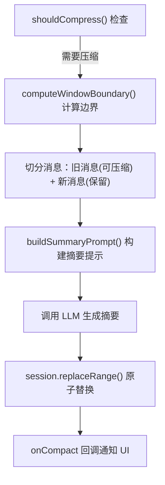
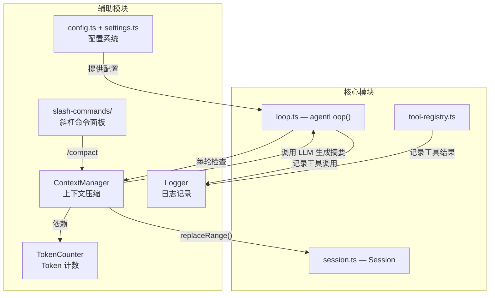

# 03 — 辅助模块详解

> **阅读时间**：约 30 分钟  
> **前置知识**：文档 02（核心模块）  
> **阅读方式**：这 5 个子模块相互独立，可以按兴趣跳读

---

本文覆盖项目中的 5 个辅助模块。它们各自独立，为主流程提供支撑服务。

---

## 3.1 ContextManager — 上下文压缩管理器

### 功能描述

LLM 的**上下文窗口**是有限的（比如 DeepSeek 是 128K tokens）。对话越长，占用的 token 越多。`ContextManager` 的职责是：

> 当对话历史超过阈值时，自动把旧的对话压缩成一段摘要，释放 token 空间。

打个比方：你和 AI 聊了 200 轮，前 150 轮的内容被压缩成一句话 "之前讨论了用户管理系统的数据库设计和 API 接口，已完成用户注册和登录功能"，然后 AI 只看到这句话 + 最近 50 轮的内容。

### 涉及文件

`packages/agent-core/src/context-manager.ts`（整个文件，258 行）

### 3.1.1 配置参数

**文件**：`packages/agent-core/src/context-manager.ts`  
**行号**：第 8-15 行

```typescript
export interface ContextManagerConfig {
  maxContextTokens: number;        // 模型的总上下文窗口大小
  windowRatio: number;             // 滑动窗口占比（保留最近的多少比例）
  compressThresholdRatio: number;  // 触发压缩的阈值比例
  reserveOutputTokens: number;     // 留给 LLM 回复的 token 数
  systemPromptTokens: number;      // system prompt 占用的 token 数
}
```

实际初始化值在 `packages/cli/src/main.ts` 第 77-83 行：

```typescript
const ctxConfig: ContextManagerConfig = {
  maxContextTokens: 128000,   // DeepSeek 的上下文窗口
  windowRatio: 0.6,          // 保留最近 60% 的 token 作为"滑动窗口"
  compressThresholdRatio: 0.9, // 总 token 达到 90% 时触发压缩
  reserveOutputTokens: 4096,  // 给 AI 回复预留空间
  systemPromptTokens: 500,    // system prompt 固定开销
};
```

### 3.1.2 核心判断逻辑

**文件**：`packages/agent-core/src/context-manager.ts`  
**行号**：第 107-109 行

```typescript
shouldCompress(session: Session): boolean {
  return this.getTokenCount(session) >= this.compressTriggerTokens;
}
```

简单说：**统计当前对话的总 token 数，如果 ≥ 窗口的 90%，就该压缩了**。

### 3.1.3 滑动窗口边界计算

**文件**：`packages/agent-core/src/context-manager.ts`  
**行号**：第 168-179 行

```typescript
private computeWindowBoundary(messages: SessionNode[]): number | null {
  let accumulated = 0;
  // 从最后一条消息往前累加 token 数
  for (let i = messages.length - 1; i >= 0; i--) {
    accumulated += this.tokenCounter.countMessage(messages[i]);
    if (accumulated >= this.windowTokens) {
      return i + 1;  // 从这条消息开始需要保留
    }
  }
  return null;  // 所有消息都在窗口内，不需要压缩
}
```

这个算法的思路是：**从后往前累加**，找到"最近的哪些消息已经填满了窗口"，边界之前的消息都是可以被压缩的。

### 3.1.4 压缩执行流程



### 3.1.5 原子替换策略

**文件**：`packages/agent-core/src/session.ts`  
**行号**：第 42-66 行（`replaceRange()` 方法）

```typescript
replaceRange(start: number, end: number, summaryNode: ...): void {
  const tmpPath = this.filePath + ".tmp";
  // 1. 先写到临时文件
  fs.writeFileSync(tmpPath, lines, "utf-8");
  // 2. 再用 rename 原子替换（操作系统保证不丢数据）
  fs.renameSync(tmpPath, this.filePath);
  // 3. 更新内存
  this.messages = newMessages;
}
```

这个"写临时文件 → rename 替换"的模式保证了：即使在替换过程中程序崩溃，也不会损坏原始数据（最多丢失正在写入的那个临时文件）。

### 3.1.6 压缩触发时机

**文件**：`packages/agent-core/src/loop.ts`  
**行号**：第 63-70 行

```typescript
// 在 agentLoop 中，每次组装请求前检查
if (contextManager.shouldCompress(session)) {
  callbacks?.onCompactStart?.();  // UI 显示"正在压缩..."
}
ctxMessages = await contextManager.getMessagesAsync(session, callbacks?.onCompact);
```

---

## 3.2 TokenCounter — Token 计数器

### 功能描述

精确计算消息消耗的 token 数，供 ContextManager 判断是否需要压缩。

### 涉及文件

`packages/agent-core/src/token-counter.ts`（整个文件，86 行）

### 3.2.1 为什么不能简单用字符数？

Token 不等于字符。比如 "Hello" 是 1 个 token，"编程" 可能是 2 个 token。LLM 的计费、上下文窗口限制都是按 token 算的。所以需要专门的 token 计算库。

**文件**：`packages/agent-core/src/token-counter.ts`  
**行号**：第 3 行

```typescript
import { encodingForModel, getEncoding } from "js-tiktoken";
```

`js-tiktoken` 是 OpenAI 开源的 token 计算库，能精确模拟 GPT 系列模型的 token 切分规则。

### 3.2.2 消息级别的 token 计算

**文件**：`packages/agent-core/src/token-counter.ts`  
**行号**：第 16-57 行（`countMessage()` 方法）

```typescript
countMessage(msg: { role: string; content: string | null; ... }): number {
  let tokens = 4;  // 每条消息的基础消耗：<|im_start|>role\ncontent<|im_end|>

  tokens += this.encoder.encode(msg.role).length;      // role 消耗
  if (msg.content) {
    tokens += this.encoder.encode(msg.content).length;  // content 消耗
  }
  if (msg.tool_calls) {
    for (const tc of msg.tool_calls) {
      tokens += this.encoder.encode(tc.function.name).length;       // 工具名
      tokens += this.encoder.encode(tc.function.arguments).length;  // 参数
      tokens += 8;  // function call 结构开销
    }
  }
  return tokens;
}
```

这个方法参考了 [OpenAI 官方 cookbook](https://github.com/openai/openai-cookbook) 的 token 计算规则。

---

## 3.3 Logger — 日志记录器

### 功能描述

以 JSONL 格式记录程序运行日志，主要用于**排查 AI 工具调用错误**。日志文件存在 `~/.heiyun/logs/` 目录下。

### 涉及文件

`packages/agent-core/src/logger.ts`（整个文件，152 行）

### 3.3.1 日志格式

**文件**：`packages/agent-core/src/logger.ts`  
**行号**：第 5-18 行

```typescript
export interface LogEntry {
  timestamp: string;    // ISO 时间戳
  level: "INFO" | "WARN" | "ERROR";
  event: string;        // 事件名：tool_call / tool_result / system
  tool?: string;        // 工具名（工具调用日志）
  params?: Record<string, unknown>;
  success?: boolean;
  output?: string;
  error?: string;
  durationMs?: number;  // 执行耗时
  sessionId?: string;
  message?: string;     // 人类可读的摘要
}
```

### 3.3.2 日志文件命名

**文件**：`packages/agent-core/src/logger.ts`  
**行号**：第 28-33 行

```typescript
// 文件名格式：heiyun-YYYYMMDD-HHmmss.log
const now = new Date();
const date = now.toISOString().slice(0, 10).replace(/-/g, "");
const time = now.toISOString().slice(11, 19).replace(/:/g, "");
this.logFilePath = path.join(this.logDir, `heiyun-${date}-${time}.log`);
```

每次启动都会创建一个新的日志文件，按时间命名，不会覆盖历史记录。

### 3.3.3 记录时机

| 方法 | 行号 | 调用时机 |
|------|------|---------|
| `logToolCall()` | 43-54 | 工具开始执行前 |
| `logToolResult()` | 59-87 | 工具执行完成后 |
| `info()` | 92-101 | 一般信息（启动、切换会话等） |
| `error()` | 106-115 | 异常情况 |
| `warn()` | 120-129 | 警告（如压缩失败） |

### 3.3.4 设计原则

**文件**：`packages/agent-core/src/logger.ts`  
**行号**：第 141-148 行

```typescript
private write(entry: LogEntry): void {
  try {
    const line = JSON.stringify(entry) + "\n";
    fs.appendFileSync(this.logFilePath, line, "utf-8");
  } catch {
    // 日志写入失败不应影响主流程
  }
}
```

关键设计：**日志失败绝不抛异常**。日志是辅助功能，不能因为写日志失败而中断用户的操作。

---

## 3.4 配置系统 — config.ts + settings.ts

### 功能描述

管理所有用户可配置的参数。分为两个层面：
- **settings.ts**：持久化配置（存在 `~/.heiyun/settings.json`）
- **config.ts**：运行时配置（合并 settings + CLI 参数 + 环境变量）

### 涉及文件

| 文件 | 作用 |
|------|------|
| `packages/cli/src/settings.ts` | 用户设置的结构定义、读写、模型列表获取 |
| `packages/cli/src/config.ts` | 运行时配置合并 |

### 3.4.1 用户设置结构

**文件**：`packages/cli/src/settings.ts`  
**行号**：第 10-16 行

```typescript
export interface SettingsData {
  providers: Record<string, ProviderConfig>;  // 服务商配置字典
  activeProvider: string | null;              // 当前使用的服务商
  activeModel: string | null;                 // 当前使用的模型
}

export interface ProviderConfig {
  apiBase: string;   // API 地址
  apiKey: string;    // API 密钥
}
```

`providers` 是一个字典，key 是服务商名（如 `"deepseek"`），value 是它的 API 地址和密钥。这样设计支持以后添加多个服务商。

**文件**：`packages/cli/src/settings.ts`  
**行号**：第 55-62 行（`saveSettings()` 方法）

```typescript
export function saveSettings(data: SettingsData): void {
  const filePath = settingsPath();
  const dir = path.dirname(filePath);
  fs.mkdirSync(dir, { recursive: true });
  fs.writeFileSync(filePath, JSON.stringify(data, null, 2), "utf-8");
}
```

### 3.4.2 模型列表获取

**文件**：`packages/cli/src/settings.ts`  
**行号**：第 65-107 行（`fetchModels()` 函数）

```typescript
export async function fetchModels(
  apiBase: string,
  apiKey: string,
  providerName: string,
  signal?: AbortSignal,
): Promise<ModelInfo[]> {
  const url = `${apiBase.replace(/\/$/, "")}/models`;  // 调用 /v1/models 接口

  // 5 秒超时
  const controller = new AbortController();
  const timeoutId = setTimeout(() => controller.abort(), 5000);

  const response = await fetch(url, { headers: { Authorization: `Bearer ${apiKey}` } });

  // 过滤：只要 chat/reasoner 类模型，不要 embedding/moderation 类
  const includeKeywords = ["chat", "reasoner", "v4"];
  const excludeKeywords = ["embedding", "moderation"];
  // ...
}
```

这个函数被 `/model` 面板调用，用来展示可供选择的模型列表。

### 3.4.3 配置优先级链

**文件**：`packages/cli/src/config.ts`  
**行号**：第 34-63 行（`loadConfig()` 函数）

```
settings.json 中的值
  ↓ (如果为 null/undefined，往下找)
CLI 命令行参数 (--model, --api-key 等)
  ↓ (如果为 null/undefined，往下找)
环境变量 (HEIYUN_CODE_MODEL 等)
  ↓ (如果为 null/undefined，往下找)
硬编码默认值
```

用代码表达就是一条很长的链：
```typescript
value = settingsValue ?? cliArg ?? envVar ?? default;
```

---

## 3.5 斜杠命令面板

### 功能描述

用户在输入框输入 `/` 开头的内容时，触发特殊功能面板，而不是发送给 AI。

### 涉及文件

| 文件 | 对应命令 | 功能 |
|------|---------|------|
| `packages/cli/src/slash-commands/login.tsx` | `/login` | 配置 API 地址和密钥 |
| `packages/cli/src/slash-commands/model.tsx` | `/model` | 选择模型 |
| `packages/cli/src/slash-commands/resume.tsx` | `/resume` | 恢复历史会话 |
| `packages/cli/src/slash-commands/compact.tsx` | `/compact` | 手动触发上下文压缩 |
| `packages/cli/src/components/input-box.tsx` | 全部 | 斜杠输入提示和补全 |

### 3.5.1 命令路由

**文件**：`packages/cli/src/app.tsx`  
**行号**：第 60-82 行（`handleSubmit`）

```typescript
const handleSubmit = useCallback((input: string) => {
  const trimmed = input.trim();

  if (trimmed === "/login")  { setSlashMode("login"); return; }
  if (trimmed === "/model")  { setSlashMode("model"); return; }
  if (trimmed === "/new")    { onNewSession(); return; }
  if (trimmed === "/resume") { setSlashMode("resume"); return; }
  if (trimmed === "/compact"){ setSlashMode("compact"); return; }

  // 其他输入当作普通消息发送
  onSubmit(trimmed);
}, [onSubmit, onNewSession, onResumeSession]);
```

核心思路：**一个 `slashMode` 状态变量控制显示哪个面板**。（详见文档 02 的模块四）

### 3.5.2 输入框命令提示

**文件**：`packages/cli/src/components/input-box.tsx`  
**行号**：第 8-15 行（命令列表定义）

```typescript
const SLASH_COMMANDS: SlashCommand[] = [
  { name: "/login", description: "配置 API 登录" },
  { name: "/model", description: "选择模型" },
  { name: "/new", description: "开启新对话" },
  { name: "/resume", description: "恢复历史对话" },
  { name: "/compact", description: "压缩上下文" },
];
```

当用户输入 `/` 时，输入框上方会出现匹配的命令列表，可以用 `Tab` 键补全、用 `↑↓` 键选择。

**文件**：`packages/cli/src/components/input-box.tsx`  
**行号**：第 27-43 行（过滤和键位处理）

```typescript
const matchingCommands = value.startsWith("/")
  ? SLASH_COMMANDS.filter((cmd) => cmd.name.startsWith(value))
  : [];

// Tab 键补全
if (key.tab && matchingCommands.length > 0) {
  setValue(matchingCommands[selectedIndex].name + " ");
}
```

---

## 辅助模块与核心模块的关系总图



---

> **下一步**：打开 `guide/04-数据流与状态管理.md`，我们把所有模块串联起来，跟踪一条用户输入如何从终端走到 AI 再走回来。
