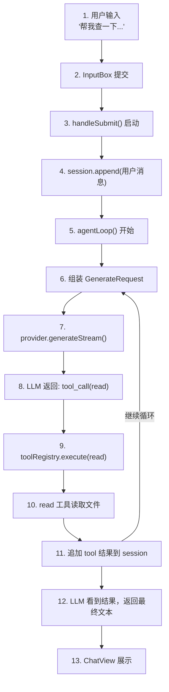
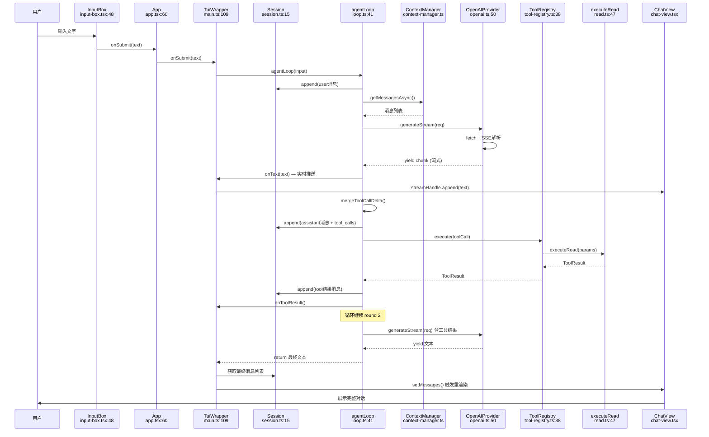

# 04 — 数据流与状态管理

> **阅读时间**：约 25 分钟  
> **前置知识**：文档 02（核心模块）+ 文档 03（辅助模块）  
> **阅读方式**：跟着一条用户输入走完全程，每步打开对应的源码位置

---

## 4.1 总览：一条用户输入的完整旅程

假设用户在终端输入了一句话：**"帮我查一下 package.json 里的项目名称"**

这句话会经历以下旅程：



让我们逐环细看。

---

## 4.2 第一环：输入捕获与提交

### 发生位置

**文件**：`packages/cli/src/components/input-box.tsx`  
**行号**：第 48-56 行（`handleSubmit`）

```typescript
const handleSubmit = (text: string) => {
  const trimmed = text.trim();
  if (!trimmed) return;

  if (showSuggestions) {
    onSubmit(matchingCommands[selectedIndex].name);
  } else {
    onSubmit(trimmed);  // ← 调用父组件传来的 onSubmit
  }
  setValue("");
};
```

`onSubmit` 是从父组件 `App` 传下来的。

### 路由判断

**文件**：`packages/cli/src/app.tsx`  
**行号**：第 60-82 行

```typescript
const handleSubmit = useCallback((input: string) => {
  const trimmed = input.trim();

  if (trimmed === "/login")  { setSlashMode("login"); return; }
  if (trimmed === "/model")  { setSlashMode("model"); return; }
  // ...

  // 不是命令 → 当作普通对话发送
  onSubmit(trimmed);  // ← 传给 main.ts 的 TuiWrapper
}, [onSubmit, onNewSession, onResumeSession]);
```

### 进入主处理函数

**文件**：`packages/cli/src/main.ts`  
**行号**：第 109-169 行（`TuiWrapper.handleSubmit`）

```typescript
const handleSubmit = useCallback(async (input: string) => {
  setIsProcessing(true);   // 锁定 UI，禁止连续发送
  streamHandleRef.current?.reset();  // 清空流式缓冲区

  try {
    await agentLoop(        // ← 进入核心循环
      provider,
      session,
      toolRegistry,
      input,                // 用户原始输入
      { model: currentModel, maxRounds: config.maxRounds, ... },
      config.workdir,
      {                     // 回调：把循环里的变化通知 UI
        onText: (text) => { streamHandleRef.current?.append(text); },
        onToolCall: (tc) => { /* 更新 UI */ },
        onToolResult: () => { /* 更新 UI */ },
        onCompactStart: () => { setCompactStatus("正在压缩上下文..."); },
        onCompact: (summary) => { /* 更新 UI */ },
      },
      logger,
      contextManager
    );
  } catch (err) {
    // 错误处理...
  } finally {
    setIsProcessing(false);
    setMessages([...session.getMessages()]);  // 刷新 UI
  }
}, [currentModel, config, provider, toolRegistry]);
```

这里 `setIsProcessing(true)` 会禁用输入框（`input-box.tsx` 第 53 行显示"处理中..."），防止用户在 AI 还没回复时又发一条。

---

## 4.3 第二环：Agent Loop 内部

### 4.3.1 追加用户消息

**文件**：`packages/agent-core/src/loop.ts`  
**行号**：第 48 行

```typescript
session.append({ role: "user", content: userInput });
```

这一步做了两件事：
1. 内存中 `session.messages` 数组 push 一条新记录
2. 磁盘上 `{sessionId}.jsonl` 文件追加一行 JSON

### 4.3.2 上下文检查与压缩

**文件**：`packages/agent-core/src/loop.ts`  
**行号**：第 63-70 行

```typescript
if (contextManager.shouldCompress(session)) {
  callbacks?.onCompactStart?.();  // UI 显示"正在压缩..."
}
ctxMessages = await contextManager.getMessagesAsync(
  session,
  callbacks?.onCompact
);
```

如果当前对话太长，这里会自动压缩（详见文档 03 的 3.1 节）。

### 4.3.3 组装请求

**文件**：`packages/agent-core/src/loop.ts`  
**行号**：第 87-98 行

```typescript
const req: GenerateRequest = {
  model: options.model,
  messages: [
    { role: "system", content: SYSTEM_PROMPT },  // 系统指令
    ...ctxMessages,                               // 全部历史对话
  ],
  tools: toolRegistry.getDefinitions(),           // 四个工具的 JSON Schema
  max_tokens: options.maxTokens,
  temperature: options.temperature,
  stream: true,                                   // 开启流式响应
  signal: options.signal,
};
```

此时 `req` 对象大致长这样：

```json
{
  "model": "deepseek-chat",
  "messages": [
    { "role": "system", "content": "You are Heiyun Code..." },
    { "role": "user", "content": "帮我查一下 package.json 里的项目名称" }
  ],
  "tools": [
    { "type": "function", "function": { "name": "read", "description": "...", "parameters": {...} } },
    { "type": "function", "function": { "name": "write", ... } },
    { "type": "function", "function": { "name": "edit", ... } },
    { "type": "function", "function": { "name": "bash", ... } }
  ]
}
```

### 4.3.4 流式接收 LLM 响应

**文件**：`packages/agent-core/src/loop.ts`  
**行号**：第 100-108 行

```typescript
let assistantContent = "";
const toolCalls: ToolCall[] = [];

for await (const chunk of provider.generateStream(req)) {
  if (chunk.type === "text") {
    assistantContent += chunk.text!;
    callbacks?.onText?.(chunk.text!);  // 每个字都实时推给 UI
  } else if (chunk.type === "tool_call") {
    mergeToolCallDelta(toolCalls, chunk.toolCall!);  // 碎片合并
  }
}
```

在这个例子里，LLM 收到的请求是"帮我查 package.json 里的项目名称"，它知道自己有 `read` 工具可以用。所以 LLM 不会直接回答，而是**发出一个工具调用**。

LLM 的流式响应片段：

```
第 1 个 chunk: { type: "text", text: "我来帮你查一下。" }
第 2 个 chunk: { type: "tool_call", toolCall: { index: 0, function: { name: "read" } } }
第 3 个 chunk: { type: "tool_call", toolCall: { index: 0, function: { arguments: "{\"path" } } }
第 4 个 chunk: { type: "tool_call", toolCall: { index: 0, function: { arguments: "\":\"package.json\"}" } } }
第 5 个 chunk: { type: "finish" }
```

经过 `mergeToolCallDelta()` 合并后，得到：

```typescript
toolCalls = [{
  id: "call_xxx",
  type: "function",
  function: {
    name: "read",
    arguments: '{"path":"package.json"}'
  }
}]
```

---

## 4.4 第三环：工具执行

### 4.4.1 追加 assistant 消息（含工具调用）

**文件**：`packages/agent-core/src/loop.ts`  
**行号**：第 112-119 行

```typescript
session.append({
  role: "assistant",
  content: assistantContent || null,  // "我来帮你查一下。"
  tool_calls: toolCalls,               // [ { read, package.json } ]
});
```

### 4.4.2 逐个执行工具

**文件**：`packages/agent-core/src/loop.ts`  
**行号**：第 121-134 行

```typescript
for (const tc of toolCalls) {
  callbacks?.onToolCall?.(tc);  // UI 显示工具调用卡片

  const result = await toolRegistry.execute(tc, {
    workdir,
    signal: options.signal,
  });

  callbacks?.onToolResult?.({
    toolCallId: tc.id,
    output: result.success ? result.output : result.error ?? result.output,
    success: result.success,
  });

  session.append({
    role: "tool",
    content: JSON.stringify(result),  // 工具结果转 JSON 字符串
    tool_call_id: tc.id,
  });
}
```

### 4.4.3 工具执行内部

**文件**：`packages/agent-core/src/tool-registry.ts`  
**行号**：第 38-68 行

```
ToolRegistry.execute()
  1. 查字典 → tools.get("read")
  2. 解析参数 → JSON.parse('{"path":"package.json"}')
  3. 调用 executeRead({ path: "package.json" }, ctx)
  4. executeRead() 内部：
     a. resolveSafePath("package.json", ctx.workdir) → 安全校验
     b. fs.readFileSync(filePath) → 读文件
     c. 返回 ToolResult { success: true, output: "带行号的文件内容..." }
```

### 4.4.4 此时 Session 的状态

经过一轮后，session 里有 3 条消息：

```
1. { role: "user",    content: "帮我查一下 package.json 里的项目名称" }
2. { role: "assistant", content: "我来帮你查一下。", tool_calls: [{ read, package.json }] }
3. { role: "tool",    content: '{"success":true,"output":"...","metadata":{...}}', tool_call_id: "call_xxx" }
```

---

## 4.5 第四环：LLM 看到工具结果后再次回复

因为 `toolCalls` 不为空，循环回到开头：

**文件**：`packages/agent-core/src/loop.ts`  
**行号**：第 56 行（`for` 循环）

现在是 round 2。`ctxMessages` 包含了上面 3 条消息 + system prompt。LLM 看到了 `read` 的结果（package.json 的内容），于是直接返回文本答案：

```
chunk: { type: "text", text: "项目名称是 heiyun-code。" }
```

这次 `toolCalls` 为空，所以进入**文本返回分支**：

**文件**：`packages/agent-core/src/loop.ts`  
**行号**：第 110-117 行

```typescript
if (toolCalls.length === 0) {
  session.append({
    role: "assistant",
    content: assistantContent,  // "项目名称是 heiyun-code。"
  });
  return assistantContent;  // 返回给 main.ts
}
```

---

## 4.6 第五环：渲染到终端

### 4.6.1 agentLoop() 返回后

**文件**：`packages/cli/src/main.ts`  
**行号**：第 163-169 行

```typescript
} finally {
  streamHandleRef.current?.flush();   // 刷新流式缓冲区
  streamHandleRef.current?.reset();
  setMessages([...session.getMessages()]);  // 更新 React 状态
  setIsProcessing(false);                    // 解锁输入框
}
```

### 4.6.2 ChatView 重新渲染

**文件**：`packages/cli/src/components/chat-view.tsx`  
**行号**：第 25-108 行

`setMessages()` 触发 React 重新渲染。`ChatView` 组件遍历 `messages` 数组，每条消息根据 `role` 渲染不同的样式：

```
🧑 你: 帮我查一下 package.json 里的项目名称

🤖 AI: 我来帮你查一下。
┌──────────────────────┐
│ 🔧 read              │
├──────────────────────┤
│ 1| {                 │
│ 2|   "name": "heiyun-code",  │
│ ...                  │
│ ✓ 成功               │
└──────────────────────┘

🤖 AI: 项目名称是 heiyun-code。
```

---

## 4.7 状态管理设计

### 4.7.1 状态的三层结构

项目中的"状态"分布在三个层次：

| 层次 | 存储位置 | 管理方式 | 生命周期 |
|------|---------|---------|---------|
| **持久层** | `~/.heiyun/sessions/*.jsonl` | Session 类（文件 I/O） | 跨进程，永久 |
| **应用状态** | React `useState` | TuiWrapper 组件 | 进程存活期间 |
| **流式缓冲** | React `useRef` | ChatView 组件 | 单次 AI 回复期间 |

### 4.7.2 为什么用 ref 而不是 state 处理流式文本？

**文件**：`packages/cli/src/main.ts`  
**行号**：第 87-91 行 + `packages/cli/src/components/chat-view.tsx` 第 115-130 行

LLM 的文本每秒可能到达几十个片段。如果每个片段都用 `setState()` 更新，React 会重渲染整个组件树几十次/秒，终端会严重卡顿。

解决思路：
1. `streamHandleRef` 是一个 **ref**，修改 ref 不会触发重渲染
2. 只有 `ChatView` 内部有一个 `streamBufferRef`（也是 ref）来缓冲文本
3. 每 33ms 批量 `flush()` 一次，触发一次 `setState`
4. 只有 `ChatView` 内部的 `streamingText` 部分重新渲染，其他组件不受影响

```typescript
// chat-view.tsx 第 116-120 行
const append = useCallback((text: string) => {
  streamBufferRef.current += text;  // ref 写入，不触发重渲染
  if (!streamTimerRef.current) {
    streamTimerRef.current = setTimeout(flush, STREAM_THROTTLE_MS);  // 33ms 后批量刷新
  }
}, [flush]);
```

### 4.7.3 数据的真实来源（Single Source of Truth）

项目中数据的"唯一真相"是 `Session` 对象：
- 内存中的 `session.messages` 数组
- 磁盘上的 JSONL 文件

React 的 `messages` 状态只是 Session 的**快照副本**，每次 `session.append()` 后需要手动 `setMessages([...session.getMessages()])` 来同步。

---

## 4.8 完整数据流图（带文件位置）



---

> **下一步**：打开 `guide/05-常见疑问与学习路线.md`，解答常见困惑，给出 JS→TS 学习路线。
