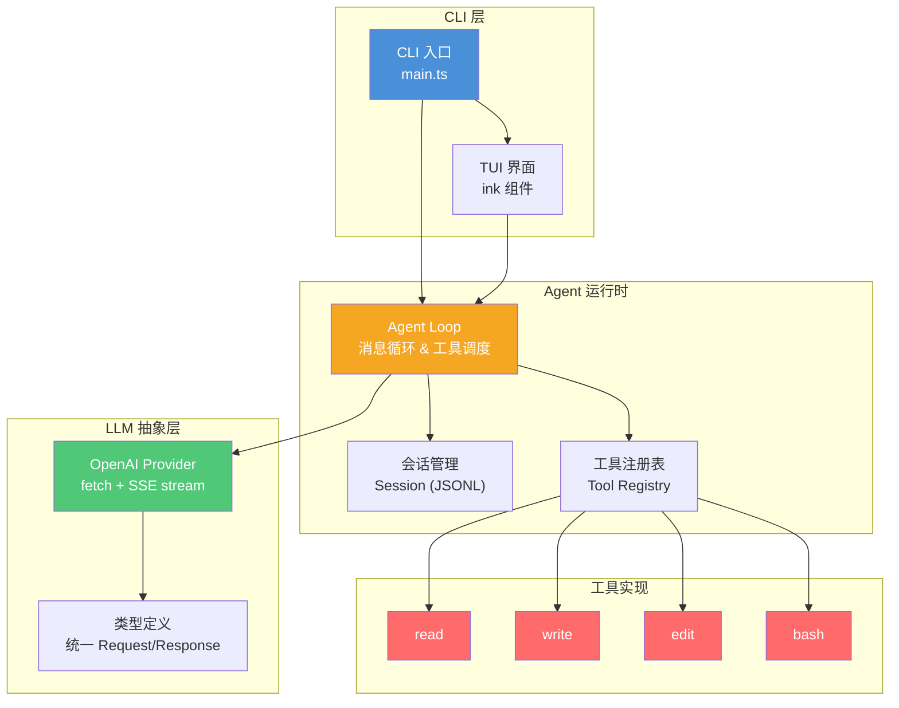
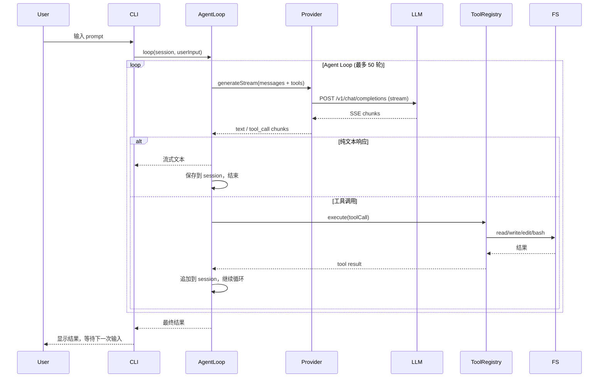

# Heiyun Code — 最小可执行版本（MVP）需求文档

**版本**：v0.1.0  
**日期**：2026-06-01  
**状态**：草案


### **一、项目概述**

#### **1.1 项目背景**

Heiyun Code 是一个交互式 AI 编码代理（Coding Agent）的 CLI 工具。用户通过终端与 Agent 进行对话，Agent 能够读取代码文件、编辑/创建文件，以及执行终端命令，从而自动化完成编码任务。

MVP 阶段目标：跑通核心链路——**用户输入 → Agent Loop → 工具调用 → 返回结果**，以最少的代码量验证整体架构的可行性。

#### **1.2 核心设计原则**

| 原则 | 说明 |
|---|---|
| **极简工具集** | 只提供 read / write / edit / bash 四个原语工具，所有复杂操作通过 bash 组合完成 |
| **模型主导** | 不在 Agent 层做任务规划、子任务拆分等复杂逻辑，信任 LLM 自身的任务分解能力 |
| **可组合** | monorepo 分包架构，各层职责清晰、独立可测、可替换 |
| **先跑通再打磨** | MVP 不做对话压缩、不做分支探索、不做多模型混合，只实现最小闭环 |

#### **1.3 范围定义**

**MVP 包含：**
- OpenAI 兼容协议的 LLM 通信层
- Agent Loop 核心循环
- 四个原语工具（read / write / edit / bash）
- 命令行入口 + 基础终端 UI
- 会话的线性 JSONL 存储

**MVP 不包含：**
- 对话压缩（compaction）
- DAG 分支会话
- 多模型混合调用
- Anthropic / Google 等其他 Provider
- 自扩展系统
- WebSocket 远程连接
- Docker 沙箱


### **二、技术选型**

| 维度 | 选型 | 理由 |
|---|---|---|
| **语言** | TypeScript | 类型安全，对工具定义和 LLM 响应解析至关重要 |
| **运行时** | Node.js ≥ 20 | LTS 版本，ESM 原生支持 |
| **包管理** | npm workspaces | monorepo 原生方案，无需额外工具 |
| **LLM 通信** | fetch + SSE 流式解析 | 零依赖，直接对接 OpenAI 兼容 API |
| **CLI 框架** | commander | 轻量、成熟、TypeScript 友好 |
| **终端 UI** | ink（React→终端） | 声明式 UI，开发效率高 |
| **文件存储** | JSONL（每行一条 JSON） | 人类可读，追加写入高效，便于调试 |

### **三、系统架构**



### **四、Monorepo 目录结构**

```
heiyun-code/
├── package.json                    # root: npm workspaces
├── tsconfig.base.json              # 基础 TS 配置
├── .gitignore
├── .npmrc                          # save-exact=true
├── README.md
│
├── packages/
│   ├── ai/                         # @heiyun/ai
│   │   ├── package.json
│   │   ├── tsconfig.json
│   │   └── src/
│   │       ├── types.ts            # 统一类型：Message, ToolCall, GenerateRequest...
│   │       ├── provider.ts         # Provider 接口定义
│   │       ├── openai.ts           # OpenAI 兼容协议实现
│   │       └── index.ts            # 导出
│   │
│   ├── agent-core/                 # @heiyun/agent-core
│   │   ├── package.json
│   │   ├── tsconfig.json
│   │   └── src/
│   │       ├── types.ts            # Session, ToolDefinition, AgentConfig
│   │       ├── loop.ts             # Agent Loop: send → receive → execute → loop
│   │       ├── session.ts          # 会话 CRUD + JSONL 持久化
│   │       ├── tool-registry.ts    # 工具注册、定义 -> LLM tool schema 转换
│   │       ├── system-prompt.ts    # 极简 System Prompt (~300 词)
│   │       └── index.ts
│   │
│   ├── tools/                      # @heiyun/tools
│   │   ├── package.json
│   │   ├── tsconfig.json
│   │   └── src/
│   │       ├── read.ts
│   │       ├── write.ts
│   │       ├── edit.ts
│   │       ├── bash.ts
│   │       └── index.ts            # 注册所有工具
│   │
│   └── cli/                        # @heiyun/cli
│       ├── package.json
│       ├── tsconfig.json
│       ├── bin/
│       │   └── heiyun.js           # package.json "bin" 入口（首行需 #!/usr/bin/env node）
│       └── src/
│           ├── main.ts             # 入口：参数解析、初始化
│           ├── app.tsx             # ink 主组件
│           ├── components/
│           │   ├── chat-view.tsx   # 对话展示
│           │   ├── input-box.tsx   # 用户输入
│           │   └── status-bar.tsx  # 状态栏
│           └── config.ts           # 配置读取（环境变量、配置文件）

```

### **四、Monorepo 目录结构（续）**

**包依赖关系：**

| 包 | 依赖 |
|---|---|
| `@heiyun/ai` | 无 |
| `@heiyun/tools` | `@heiyun/ai` |
| `@heiyun/agent-core` | `@heiyun/ai`, `@heiyun/tools` |
| `@heiyun/cli` | `@heiyun/agent-core`, `@heiyun/ai`, `@heiyun/tools` |

### **五、模块详细设计**

#### **5.1 @heiyun/ai — LLM 抽象层**

##### **5.1.1 统一类型定义**

```typescript
// types.ts

// === 消息 ===
interface TextContent { type: "text"; text: string; }
interface ImageContent { type: "image_url"; image_url: { url: string; }; }
type ContentPart = TextContent | ImageContent;

interface Message {
  role: "system" | "user" | "assistant" | "tool";
  content: string | ContentPart[];
  tool_call_id?: string;
  tool_calls?: ToolCall[];
  name?: string;
}

// === 工具 ===
interface ToolParameter {
  type: string;          // 参数类型：string, number, boolean, object 等
  description: string;   // 参数描述，LLM 可见
  enum?: string[];       // 仅 type="string" 时有效，限定可选值列表
  properties?: Record<string, ToolParameter>;  // 仅 type="object" 时有效，定义子属性
  required?: string[];   // 仅 type="object" 时有效，标记必填子属性
}

interface ToolDefinition {
  name: string;
  description: string;
  parameters: ToolParameter;
}

// === 工具调用 ===
interface ToolCall {
  id: string;
  type: "function";
  function: {
    name: string;
    arguments: string; // JSON string
  };
}

// === 工具调用 Delta（用于流式合并） ===
interface ToolCallDelta {
  index: number;
  id?: string;
  type: "function";
  function?: {
    name?: string;
    arguments?: string;
  };
}

// === LLM 交互 ===
interface GenerateRequest {
  model: string;
  messages: Message[];
  tools?: ToolDefinition[];
  tool_choice?: "auto" | "none" | "required";  // 控制工具调用时机，默认 "auto"
  max_tokens?: number;
  temperature?: number;
  stream?: boolean;           // 是否流式返回，默认 true
  signal?: AbortSignal;       // 用于取消请求（如 Ctrl+C）
}

interface GenerateChunk {
  type: "text" | "tool_call" | "finish";
  text?: string;
  toolCall?: Partial<ToolCallDelta>;
}

// === Provider 接口 ===
interface LLMProvider {
  generateStream(req: GenerateRequest): AsyncGenerator<GenerateChunk>;
}
```

##### **5.1.2 OpenAI 兼容协议实现**

- 通过环境变量 `HEIYUN_CODE_API_BASE`、`HEIYUN_CODE_API_KEY`、`HEIYUN_CODE_MODEL` 配置
- 使用原生 `fetch` 调用 `/v1/chat/completions`，stream 模式
- 手动解析 SSE 数据流，逐 chunk yield
- 处理 `content`、`tool_calls` delta 两种 chunk 类型
- 网络错误重试 2 次，间隔指数退避

**关键代码路径：**
```
openai.ts:
  generateStream(req)
    → 构建 OpenAI 格式请求体
    → fetch(apiBase + "/v1/chat/completions", { body, headers, signal })
    → 流式读取 response.body
    → ReadableStream → SSE line parser
    → 解析 data: { choices[0].delta }
    → yield text chunk / tool_call delta / finish
```

##### **5.1.3 SSE 解析器规范**

SSE 原始流格式：
```
data: {"id":"chatcmpl-xxx","object":"chat.completion.chunk","choices":[{"delta":{"content":"你好"}}]}

data: {"id":"chatcmpl-xxx","object":"chat.completion.chunk","choices":[{"delta":{"tool_calls":[{"index":0,"function":{"name":"read","arguments":"{\"p"}}]}}]}}

data: [DONE]
```

解析逻辑：
- 按 `\n\n` 分割事件
- 提取 `data:` 行
- `[DONE]` 表示结束，yield `{ type: "finish" }`
- `choices[0].delta.content` 存在 → yield `{ type: "text", text }`
- `choices[0].delta.tool_calls` 存在 → 累积拼接，yield `{ type: "tool_call", toolCall }`

##### **5.1.4 Tool Call Delta 合并算法**

OpenAI 流式响应中，一个完整的工具调用可能分散在多个 SSE chunk 中：
- `function.name` 只在每个 `index` 的第一个 chunk 中出现
- `function.arguments` 以 JSON 字符串片段形式分散在多个 chunk 中
- 最后一个 chunk 携带 `finish_reason: "tool_calls"`，标志该工具调用完整

```typescript
// 合并算法伪代码
function mergeToolCallDelta(
  toolCalls: ToolCall[],
  delta: Partial<ToolCallDelta>
): void {
  if (!delta.function) return;

  const { index } = delta; // OpenAI 每个 tool_call 有唯一的 index

  // 确保数组长度足够
  while (toolCalls.length <= index) {
    toolCalls.push({
      id: "",
      type: "function",
      function: { name: "", arguments: "" },
    });
  }

  const target = toolCalls[index];

  // id 只出现在第一个 chunk
  if (delta.id) {
    target.id = delta.id;
  }

  // name 只在第一个 chunk 出现
  if (delta.function.name) {
    target.function.name = delta.function.name;
  }

  // arguments 分片累积拼接
  if (delta.function.arguments) {
    target.function.arguments += delta.function.arguments;
  }
}
```

**关键注意事项：**
- 不要假设所有字段在同一个 chunk 中出现
- `index` 决定合并到哪个 tool_call 槽位
- arguments 是**追加拼接**，不是替换
- 工具调用在 LLM 返回 `finish_reason: "tool_calls"` 时才视为完整
- 当工具调用完整收集后，对 `arguments` 做 JSON.parse 验证；若解析失败，向 LLM 返回包含原始 arguments 的错误信息，让其修正后重试

#### **5.2 @heiyun/agent-core — Agent 运行时**

##### **5.2.1 Agent Loop 核心循环**

```
┌─────────────────────────────────────────────────┐
│                   Agent Loop                      │
│                                                   │
│  1. 组装请求                                      │
│     ├── system prompt                             │
│     ├── 历史消息（从 session 加载）                │
│     ├── 当前用户输入                               │
│     └── 工具定义列表                               │
│                                                   │
│  2. 发送给 LLM                                    │
│     └── provider.generateStream(req)               │
│                                                   │
│  3. 收集响应                                      │
│     ├── 纯文本 → 追加到 session，返回给用户         │
│     └── 工具调用 → 进入步骤 4                      │
│                                                   │
│  4. 执行工具                                      │
│     ├── 从 toolRegistry 查找 handler               │
│     ├── 执行 handler(params)                       │
│     ├── 将 tool result 追加到 session              │
│     └── 回到步骤 1（模型带着工具结果继续决策）      │
│                                                   │
│  终止条件：                                       │
│  ├── LLM 返回纯文本（无工具调用）                   │
│  ├── 达到最大循环次数（默认 50 轮）                 │
│  └── 用户中断（Ctrl+C）                            │
└─────────────────────────────────────────────────┘
```

```typescript
// loop.ts 核心逻辑伪代码
async function agentLoop(
  provider: LLMProvider,
  session: Session,
  toolRegistry: ToolRegistry,
  userInput: string,
  options: LoopOptions
): Promise<string> {
  // 1. 添加用户消息
  session.append({ role: "user", content: userInput });

  let round = 0;

  while (round < options.maxRounds) {
    round++;

    // 2. 构建请求
    const messages = session.getMessages();
    const req: GenerateRequest = {
      model: options.model,
      messages: [
        { role: "system", content: SYSTEM_PROMPT },
        ...messages,
      ],
      tools: toolRegistry.getDefinitions(),
      max_tokens: options.maxTokens,
    };

    // 3. 调用 LLM
    let assistantContent = "";
    const toolCalls: ToolCall[] = [];

    for await (const chunk of provider.generateStream(req)) {
      if (chunk.type === "text") {
        assistantContent += chunk.text!;
        onText?.(chunk.text!); // 流式输出给 UI
      } else if (chunk.type === "tool_call") {
        mergeToolCallDelta(toolCalls, chunk.toolCall!);
      }
    }

    // 4. 无工具调用 → 结束
    if (toolCalls.length === 0) {
      session.append({ role: "assistant", content: assistantContent });
      return assistantContent;
    }

    // 5. 有工具调用 → 执行
    session.append({
      role: "assistant",
      content: assistantContent || null,
      tool_calls: toolCalls,
    });

    for (const tc of toolCalls) {
      const result = await toolRegistry.execute(tc);
      session.append({
        role: "tool",
        content: result,
        tool_call_id: tc.id,
      });
    }
  }

  throw new Error(`Agent loop exceeded max rounds (${options.maxRounds})`);
}
```

##### **5.2.2 System Prompt（极简，~300 词）**

```
You are Heiyun Code, an interactive coding agent CLI.

You have these tools:
- read(path, offset?, limit?): Read a file. Use to inspect code.
- write(path, content): Create or overwrite a file.
- edit(path, old_string, new_string): Replace EXACT old_string with new_string in file.
- bash(command, workdir?): Execute a shell command. Returns stdout and stderr.

Rules:
- Read files before editing them.
- Use edit for small changes, write for creating new files or large rewrites.
- For git, testing, building, linting, searching — use bash.
- Keep responses concise. Show your reasoning briefly, then act.
- When done, summarize what you changed and why.
- Work in the current working directory unless told otherwise.
```

##### **5.2.3 会话管理**

```typescript
// session.ts — 线性会话（MVP 阶段，不做 DAG）

interface SessionNode {
  id: string;           // UUID
  timestamp: string;    // ISO 8601
  role: "system" | "user" | "assistant" | "tool";
  content: string | null;
  tool_calls?: ToolCall[];
  tool_call_id?: string;
  name?: string;
}

class Session {
  id: string;
  filePath: string;    // sessions/{id}.jsonl
  private messages: SessionNode[];

  constructor(sessionDir: string, id?: string);
  
  append(node: Omit<SessionNode, "id" | "timestamp">): void;
  getMessages(): SessionNode[];
  toMessages(): Message[];
  
  static load(filePath: string): Session;
  static list(sessionDir: string): SessionMeta[];
}
```

**JSONL 存储格式：**
```
{"id":"a1b2c3","timestamp":"2026-06-01T06:00:00.000Z","role":"user","content":"帮我修复 src/utils.ts 的类型错误"}
{"id":"d4e5f6","timestamp":"2026-06-01T06:00:03.000Z","role":"assistant","content":null,"tool_calls":[{"id":"call_1","type":"function","function":{"name":"read","arguments":"{\"path\":\"src/utils.ts\"}"}}]}
{"id":"g7h8i9","timestamp":"2026-06-01T06:00:04.000Z","role":"tool","content":"export function add(a, b) {\n  return a + b;\n}\n","tool_call_id":"call_1"}
```

##### **5.2.4 工具注册**

```typescript
// tool-registry.ts

interface ToolHandler {
  definition: ToolDefinition;
  execute(params: Record<string, unknown>): Promise<string>;
}

class ToolRegistry {
  private tools: Map<string, ToolHandler> = new Map();

  register(handler: ToolHandler): void;
  getDefinitions(): ToolDefinition[];
  execute(toolCall: ToolCall): Promise<string>;
}
```

#### **5.3 @heiyun/tools — 四个原语工具**

##### **5.3.0 工具通用规范**

**路径解析规则（适用于 read / write / edit）：**

所有文件操作工具使用统一的两步路径解析：
1. 若 `path` 为绝对路径 → 直接使用
2. 若 `path` 为相对路径 → 基于**会话启动时的工作目录**（`workdir`）解析

路径安全校验：
- 解析后的绝对路径必须在 `workdir` 子树内（拒绝 `../` 穿越）
- 系统敏感路径硬编码拒绝列表：`/etc`、`/proc`、`/sys`、`~/.ssh`、`~/.gnupg` 等
- 校验在工具执行层统一处理，各工具无需单独实现

**工具执行结果格式（ToolResult）：**

工具执行后统一返回以下 JSON 结构，供 LLM 解析：

```typescript
// @heiyun/ai/types.ts 中定义
interface ToolResult {
  success: boolean;          // true 表示工具执行成功
  output: string;            // 人类可读的执行结果
  error?: string;            // 失败原因（仅 success=false 时存在）
  metadata?: {               // 可选元数据
    bytes_read?: number;     // read: 读取字节数
    bytes_written?: number;  // write: 写入字节数
    replacements?: number;   // edit: 替换处数
    exit_code?: number;      // bash: 命令退出码
    duration_ms?: number;    // bash: 执行耗时
  };
}
```

返回值以 JSON 字符串形式写入 session（`role: "tool"` 消息的 `content` 字段），LLM 可见并据此决策下一步动作。

##### **5.3.1 read 工具**

| 属性 | 值 |
|---|---|
| **名称** | `read` |
| **描述** | Read a file from the filesystem. Returns content in ToolResult JSON format (same as write/edit/bash). |
| **参数** | `path` (string, required): 文件路径，相对于当前工作目录 |
| | `offset` (number, optional): 起始行号，从 1 开始 |
| | `limit` (number, optional): 读取行数 |
| **返回值** | 统一返回 ToolResult JSON 结构（包含 success/output/error/metadata 字段） |
| **安全限制** | 拒绝绝对路径中 `..` 穿透超出工作目录；最大读取 5000 行 |
| **错误处理** | 文件不存在 → `Error: File not found: {path}`；目录 → `Error: Path is a directory: {path}` |

##### **5.3.2 write 工具**

| 属性 | 值 |
|---|---|
| **名称** | `write` |
| **描述** | Create a new file or completely overwrite an existing file. Parent directories are created automatically. |
| **参数** | `path` (string, required): 文件路径 |
| | `content` (string, required): 文件内容 |
| **返回值** | `Wrote {bytes} bytes to {path}` |
| **安全限制** | 同样拒绝路径穿透；拒绝写入 `/etc`、`~/.ssh` 等系统敏感路径 |
| **注意** | 这是全量覆盖，无 diff。对已有文件的小修改应使用 edit |

##### **5.3.3 edit 工具**

| 属性 | 值 |
|---|---|
| **名称** | `edit` |
| **描述** | Perform exact string replacement in a file. Searches for old_string and replaces it with new_string. |
| **参数** | `path` (string, required): 文件路径 |
| | `old_string` (string, required): 要替换的精确文本 |
| | `new_string` (string, required): 替换后的文本 |
| **返回值** | `Edited {path}: replaced {n} occurrence(s)` |
| **匹配逻辑** | 精确字符串匹配，必须保证 old_string 在文件中唯一匹配。若匹配 0 次报错，超过 1 次也报错并提示使用更大上下文。 |
| **典型场景** | 修改函数体中的几行、修改变量名、调整 import 语句 |

##### **5.3.4 bash 工具**

| 属性 | 值 |
|---|---|
| **名称** | `bash` |
| **描述** | Execute a shell command and return stdout and stderr. |
| **参数** | `command` (string, required): 要执行的命令 |
| | `workdir` (string, optional): 若指定，则覆盖会话级 workdir 作为本次命令的执行目录；若为相对路径则基于会话 workdir 解析 |
| **返回值** | `stdout:\n{stdout}\n\nstderr:\n{stderr}\n\nexit code: {code}` |
| **超时** | 默认 120 秒，可配置 |
| **安全限制** | 禁止 `rm -rf /`、`sudo` 等危险命令的黑名单检查；工作在指定 workdir 内 |
| **Shell** | 使用 `/bin/bash -c`（Linux/macOS）或 `cmd.exe /c`（Windows） |

#### **5.4 @heiyun/cli — CLI 入口与终端 UI**

##### **5.4.1 命令行接口**

```
Usage: heiyun [options]

Options:
  -m, --model <name>      模型名称 (default: env HEIYUN_CODE_MODEL or "gpt-4o")
  -s, --session <id>      恢复指定会话
  -l, --list              列出所有历史会话
  -d, --workdir <path>    工作目录 (default: cwd)
  --max-rounds <n>        最大工具调用轮次 (default: 50)
  --temperature <t>       生成温度 0.0~2.0 (default: 0.7)
  --api-base <url>        API 地址 (default: env HEIYUN_CODE_API_BASE)
  --api-key <key>         API 密钥 (default: env HEIYUN_CODE_API_KEY)
  -v, --version           显示版本号
  -h, --help              显示帮助

Examples:
  heiyun                          # 进入交互模式
  heiyun -s abc123                # 恢复会话 abc123
  heiyun -l                       # 列出历史会话
```

##### **5.4.2 终端 UI（ink 实现）**

```
┌──────────────────────────────────────────────────┐
│  Heiyun Code v0.1.0          session: a1b2c3     │
│  model: gpt-4o                 workdir: ~/project │
├──────────────────────────────────────────────────┤
│                                                   │
│  🤖 我来帮您修复这个类型错误。先读取文件看看。     │
│                                                   │
│  🔧 [read] src/utils.ts                          │
│  结果:                                            │
│  ┌─────────────────────────────────────────┐     │
│  │ 1│ export function add(a: any, b: any) { │     │
│  │ 2│   return a + b;                       │     │
│  │ 3│ }                                     │     │
│  └─────────────────────────────────────────┘     │
│                                                   │
│  🤖 找到了，参数类型是 any，需要改成 number。     │
│                                                   │
│  🔧 [edit] src/utils.ts                          │
│  已修改 1 处。                                    │
│                                                   │
├──────────────────────────────────────────────────┤
│  > _                                       [Ctrl+C 退出]  │
└──────────────────────────────────────────────────┘
```

**ink 组件结构：**

```typescript
// app.tsx
<App>
  <StatusBar sessionId model workdir />      // 顶部状态栏
  <ChatView messages={messages} />           // 对话历史（可滚动）
  <InputBox onSubmit={handleSubmit} />       // 输入框
</App>
```

**核心状态流：**
```
InputBox.submit
  → App.handleSubmit(prompt)
    → agentLoop() 开始
      → onText callback → 流式更新 ChatView 中当前消息
      → onToolCall callback → 显示工具调用状态
      → onToolResult callback → 显示工具返回结果
    → agentLoop() 结束
    → 等待下一次用户输入
```

##### **5.4.3 配置文件与环境变量**

```
# .env（可选，优先级低于命令行参数）
HEIYUN_CODE_API_BASE=https://api.openai.com/v1
HEIYUN_CODE_API_KEY=sk-xxxx
HEIYUN_CODE_MODEL=gpt-4o
HEIYUN_CODE_MAX_ROUNDS=50
HEIYUN_CODE_TEMPERATURE=0.7
HEIYUN_CODE_SESSION_DIR=~/.heiyun/sessions
```

> **注意：** 路径中的 `~` 不会被 Node.js 自动展开。`config.ts` 中需使用 `os.homedir()` 手动替换 `~` 为用户主目录的绝对路径。

### **六、数据流总览**



### **七、错误处理策略**

| 错误场景 | 处理方式 |
|---|---|
| **API 不可达** | 重试 2 次，间隔 1s/3s。仍失败则提示用户检查网络和 API 配置 |
| **API 返回 4xx** | 显示具体错误信息（401=API Key 错误，429=限流等），不重试 |
| **API 返回 5xx** | 重试 2 次，仍失败则终止本轮 |
| **工具执行超时** | bash 默认 120s 超时，超时后 kill 进程并返回超时信息 |
| **read 文件不存在** | 返回明确错误信息，让 LLM 自行纠正路径 |
| **edit 匹配失败** | 返回「匹配 0 处」或「匹配 N>1 处」的错误，建议 LLM 用 read 重新确认 |
| **bash 执行失败** | 返回 stdout + stderr + exit code，让 LLM 自行分析和修复 |
| **Agent Loop 超过最大轮次** | 终止并提示用户，保存当前会话状态 |
| **用户 Ctrl+C** | 在 Agent Loop 中捕获 SIGINT，优雅退出并保存会话 |
| **Tool arguments 解析失败** | JSON.parse 失败时返回错误信息（含原始 arguments），让 LLM 自行修正重试 |

### **八、开发路线图**

#### **阶段 1：项目骨架（预计 1-2 天）**

- [ ] 初始化 monorepo（npm workspaces + TypeScript）
- [ ] 创建 4 个 package 的骨架目录和 `package.json`
- [ ] 编写 `tsconfig.base.json` + 各包 `tsconfig.json`
- [ ] 配置 `.gitignore`、`.npmrc`、ESLint/Prettier
- [ ] 跑通 `npm install && npm run build` 全量构建

#### **阶段 2：LLM 抽象层（预计 1-2 天）**

- [ ] 实现 `@heiyun/ai/types.ts` 所有类型定义
- [ ] 实现 `OpenAIProvider` 的 SSE 流式解析
- [ ] 编写单元测试（mock fetch，验证 SSE 解析正确性）
- [ ] 用真实 API 做集成验证

#### **阶段 3：工具实现（预计 1 天）**

- [ ] 实现 `read` 工具 + 测试
- [ ] 实现 `write` 工具 + 测试
- [ ] 实现 `edit` 工具 + 测试
- [ ] 实现 `bash` 工具 + 测试
- [ ] 实现 `ToolRegistry` 的注册和查找逻辑

#### **阶段 4：Agent 运行时（预计 2 天）**

- [ ] 实现 Session 类（JSONL 读写）
- [ ] 实现 `ToolRegistry`
- [ ] 实现 `AgentLoop` 核心循环
- [ ] 组装 LLM Provider + Tools + Session 做端到端测试
- [ ] 编写 System Prompt

#### **阶段 5：CLI & TUI（预计 2-3 天）**

- [ ] 实现 `main.ts`（commander 参数解析）
- [ ] 实现 ink 组件（`App`、`ChatView`、`InputBox`、`StatusBar`）
- [ ] 流式输出文本到 TUI
- [ ] 显示工具调用状态和结果
- [ ] 错误提示和用户引导

#### **阶段 6：联调与打磨（预计 1-2 天）**

- [ ] 端到端测试：真实编码任务（修 bug、加功能、重构）
- [ ] 边界情况测试（大文件、超长输出、异常中断恢复）
- [ ] 编写 README 和用户文档
- [ ] 发布 v0.1.0

---

### **九、验收标准（MVP）**

1. **启动**：`npx heiyun` 进入交互式对话界面
2. **会话恢复**：`npx heiyun -s <id>` 可恢复之前的会话继续对话
3. **read 工具**：Agent 能够读取项目中的源代码文件
4. **write 工具**：Agent 能够创建新文件，内容正确
5. **edit 工具**：Agent 能够在已有文件中精确修改指定代码段
6. **bash 工具**：Agent 能够执行 `ls`、`git status`、`npm test` 等命令并获取结果
7. **流式输出**：用户能实时看到 LLM 逐 token 输出的文本
8. **错误处理**：API 不可达、文件不存在、命令执行失败等场景均有合理提示，不崩溃
9. **会话持久化**：每次对话自动保存为 JSONL 文件，重启后可恢复

---

这份需求文档覆盖了 MVP 的全部核心模块和关键决策点。建议从**阶段 1（项目骨架）**开始动手，把 monorepo 跑通后就进入 LLM 抽象层——这是整个系统唯一"脏"的部分，做完它后面都是相对标准化的工程实现。有任何模块需要我展开细化的，随时说。

*内容由 AI 生成仅供参考*